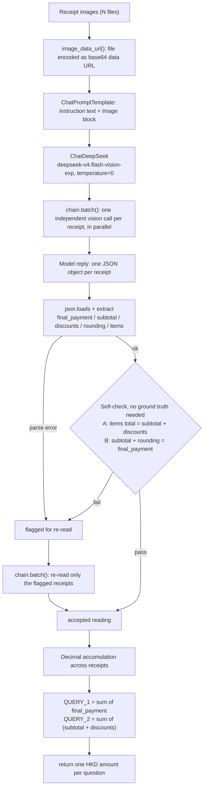

# FTEC5660 Homework 1: Receipt Chain

Build a LangChain pipeline that reads every supermarket receipt in a folder
with the vision-capable DeepSeek Flash model and answers these two questions:

1. How much money did I spend in total for these bills?
2. How much would I have had to pay without the discount?

For this homework, **amount spent** means the final payment after the receipt's
rounding line. **Without the discount** means the sum of the original positive
item prices: add back every promotion, coupon, member, app, packaging-damage,
and percentage discount, but do not add back rounding.

## Student task

Only edit the two functions in `hw1.py` that contain `### YOUR CODE HERE`:

- `build_chain()` creates your LangChain chain.
- `answer_queries()` runs the chain on the receipt images and returns one final
  response for each question.

You may use prompt chaining, routing, parallel calls, reflection, or a
combination. Your final responses should each contain one HKD amount. Do not
hard-code filenames or public answers; grading uses unseen receipt folders.

## Setup and public test

```bash
python3 -m venv .venv
source .venv/bin/activate
pip install -r requirements.txt
```

Put your DeepSeek key after `DEEPSEEK_API_KEY=` in `.env`, then run:

```bash
python3 hw1.py --image-folder public_test
```

The program creates `results.csv` in the current directory. Its columns are
`query`, `model_response`, and `correctness`. The public answers are in
`public_test/ground_truth.json`. The starter intentionally returns the dummy
response `please design your chain to answer these two queries.` so it runs
before you add any API code.

The required model is `deepseek-v4-flash-vision-exp`, the vision-capable
DeepSeek Flash model. JPEG, PNG, GIF, and WebP inputs are accepted by the
homework runner.


## Homework 1 solution

### Chain design



### Solution description

The central design decision is to separate reading from arithmetic — the model does the reading, the program does the calculating. The reason is that the model's own arithmetic is not reproducible: the same sum asked twice can come back with two different answers, whereas code computing it always returns the same result for the same input. The prompt therefore asks the model to do nothing but extraction: for each receipt, read the final payment, the subtotal, every discount line, the rounding line and the item detail, with the format pinned down — every discount must be given as a positive number (the sign is always "minus", so taking the absolute value lets the values be added directly and removes one opportunity for error), while the rounding line keeps its original sign, because it can go either way. Given those fields the two answers are computed in code: the final payment is the answer to query 1, and the subtotal plus all discounts is the answer to query 2. To make the extraction trustworthy I cross-check it with two identities that must hold on any well-formed receipt — subtotal + discounts = item total and subtotal + rounding = final payment — so the check needs no ground truth, and a receipt that fails either identity, or fails to parse at all, is read again, which reduces the risk of an occasional misreading reaching the final answer. In debugging I ran into several problems and located each of them by looking at the individual field values in the logs: an unclear prompt made the output format inconsistent from run to run (fixed with a worked output example, and by re-formatting the response in code); asking for the rounding amount as a positive number silently broke the second identity; and on receipt2 of the public set the second discount line is printed too small in the photo, so the model sometimes read a neighbouring digit (fixed by adding an explicit rule that the discount is always the right-most signed number on that line).

### Verification on the public set

Five consecutive runs of `python hw1.py --image-folder public_test` produced
`HK$1974.30` for query 1 and `HK$2348.20` for query 2, matching
`public_test/ground_truth.json`. A per-receipt, per-field comparison against the
ground truth (final payment, subtotal, discount total, and the discount-before
total) reported 35 / 35 fields correct across those five runs.

Repeated testing showed that the extraction is not fully deterministic: the
vision model occasionally misreads a single discount line, and such a misreading
can be internally *consistent*, in which case the self-check above cannot detect
it. The re-read step therefore reduces the frequency of these failures but does
not eliminate them. Every failure observed so far has been confined to query 2,
which is consistent with the discount lines being the hardest part of a receipt
to read reliably — they are printed smaller than the item lines, there can be
many of them, and several carry numbers inside their own label text.

